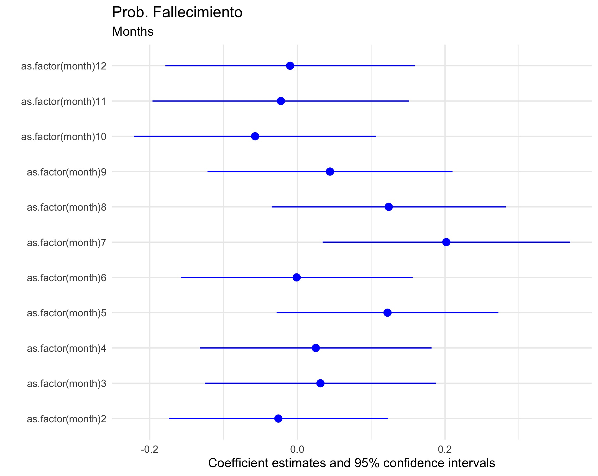
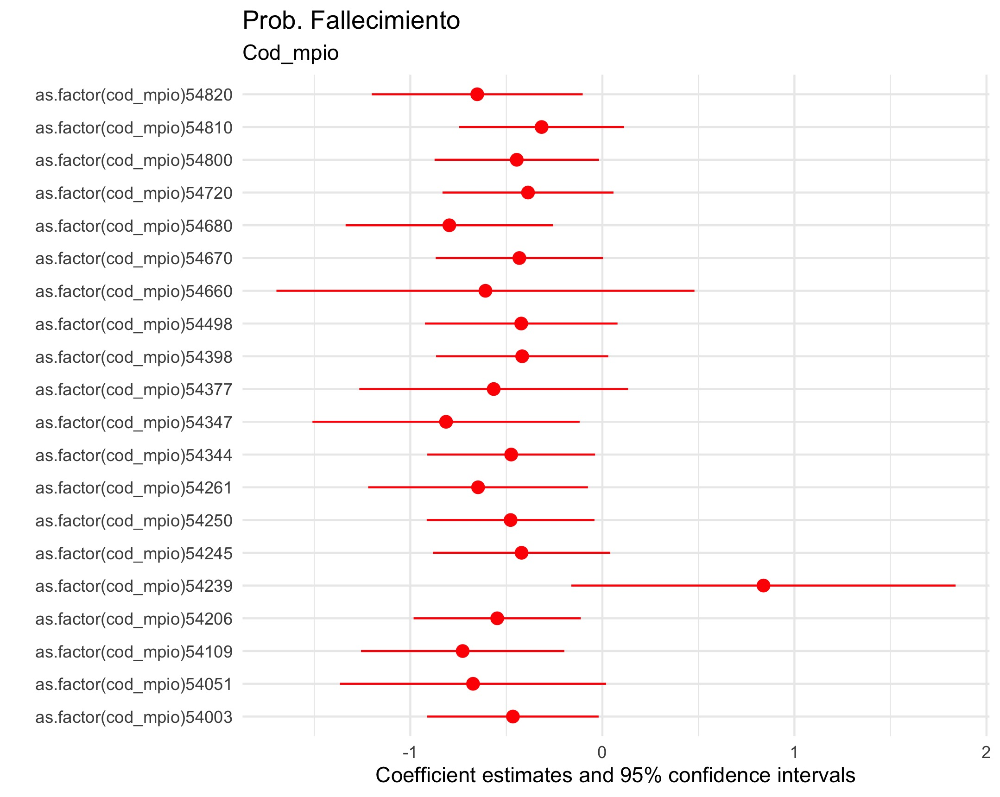
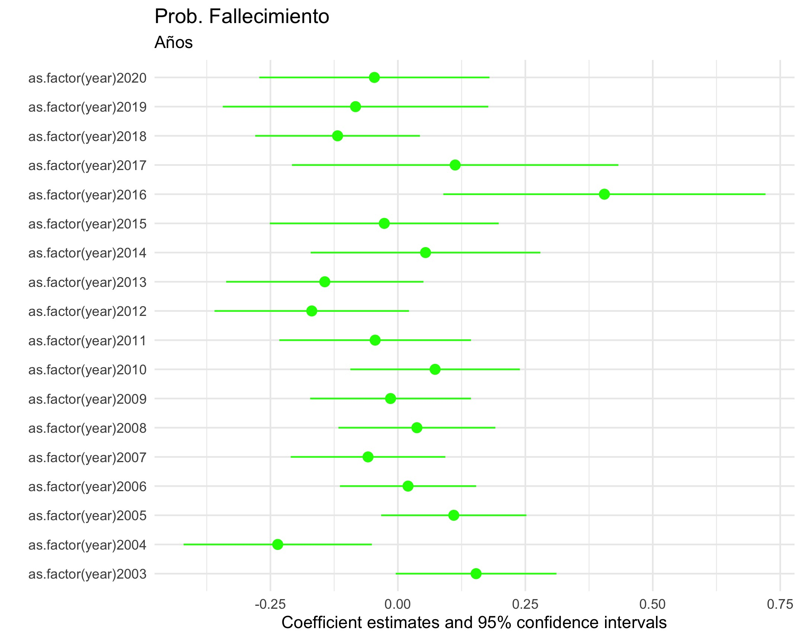
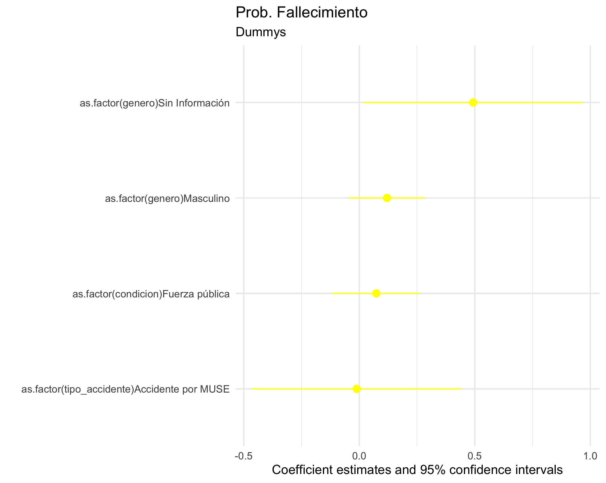
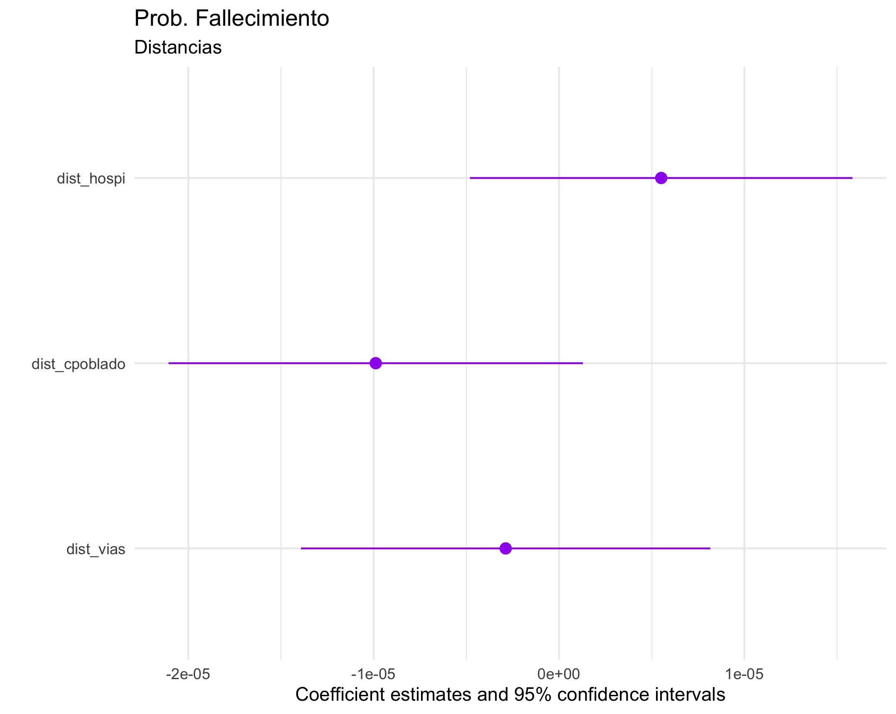

```{r setup, include=FALSE}
knitr::opts_chunk$set(echo = TRUE)
```

## **Punto 1: Datos Espaciales**

En el punto 1, nos piden utilizar el Marco Geo Estadísitico Nacional - MGN del DANE para 
graficar los centros médicos, centros poblados y ataques por minas antipersonas en el 
Norte de Santander. Para lo anterior, nos pedían seguir los siguientes pasos: 

### **1.1 Importar Datos Espaciales**

```{r eval=FALSE}
# 1.1.1 De la carpeta data/outpu importe los shapefiles de VIAS (llame al objeto via) 
# y MGN_URB_TOPONIMIA (llame al objeto puntos). 

via = st_read("task_3/data/input/VIAS.shp")
puntos = st_read("task_3/data/input/MGN_URB_TOPONIMIA.shp")

#1.1.2 Cree un nuevo objeto llamado c_medico, que contenga las observaciones del
#objeto puntos en las que la variable CSIMBOL sea igual a "021001" "021002" o "021003".

c_medico = puntos %>% filter(  CSIMBOL == "021001" 
                             | CSIMBOL == "021002" 
                             | CSIMBOL ==  "021003" )

#1.1.3 De la carpeta data/output importe los c poblado (2017).rds (llame al objeto c poblado).

c_poblado = readRDS("task_3/data/input/c poblado (2017).rds")

# 1.1.3 dp deptos (2017).rds (llame al objeto depto) 

depto = readRDS("task_3/data/input/dp deptos (2017).rds")

# y victimas_map-muse.rds (llame al objeto mapmuse).

mapmuse = readRDS("task_3/data/input/victimas_map-muse.rds")

# Asegúrese de dejar únicamente código DANE >= 54001 & < 55000 

c_poblado = c_poblado %>% filter( cod_dane >= 54001, cod_dane < 55000 )
mapmuse = mapmuse %>% filter( cod_mpio >= 54001, cod_mpio < 55000 )

#y el polígono de Norte de Santander.

depto = depto %>% filter( cod_dpto == 54)
```

### **1.2 Atributos de los Objetos**

```{r eval = FALSE}
#Sacamos algunas estadísiticas descriptivas de los objetos de 

# Centro Poblado
skim(c_poblado)

# Mapmuse
skim(mapmuse)

# Centro Médico
skim(c_medico)

# El resto de objetos son muy grandes o no tienen estadísiticas descriptivas interesantes

```

### **1.3 Geometrías del Objeto**

```{r eval = FALSE}
# 1.3.1 Para todos los objetos del punto 1.1., pinte sobre la consola la caja de 
# coordenadas (st _bbox) y el CRS de cada objeto.

vars <- list(via, puntos, c_medico, c_poblado, depto, mapmuse)
vars_names <- list('via', 'puntos', 'c_medico', 'c_poblado', 'depto' ,'mapmuse')
i = 1

for(var in vars){
  print(vars_names[i])
  print('Caja de Coordenadas')
  print(var  %>%  st_bbox())
  print('CRS')
  print(var  %>%  st_crs())
  print('')
  i <- i + 1 
}

# 1.3.2 Ahora va a re proyectar el CRS de todos los objetos. Asigne la siguiente 
# CRS a todos los objetos del punto 1.1..


sf_df1 = st_as_sf(x = c_medico, coords = 'geometry', crs = "+proj=utm +zone=19 +datum=WGS84 +units=m +no_ defs")
sf_df2 = st_as_sf(x = c_poblado, coords = 'geometry', crs = "+proj=utm +zone=19 +datum=WGS84 +units=m +no_ defs")
sf_df3 = st_as_sf(x = mapmuse, coords = 'geometry', crs = "+proj=utm +zone=19 +datum=WGS84 +units=m +no_ defs")
sf_df4 = st_as_sf(x = depto, coords = 'geometry', crs = "+proj=utm +zone=19 +datum=WGS84 +units=m +no_ defs")
sf_df5 = st_as_sf(x = via, coords = 'geometry', crs = "+proj=utm +zone=19 +datum=WGS84 +units=m +no_ defs")

#NOTA: Lo anterior también se puede hacer con st_transform() sin embargo decidimos usar este método
```

### **1.4 Operaciones Geómetricas**

```{r eval = FALSE}
# 1.4.1 Use el objeto depto para hacer cliping y dejar los puntos de mapmuse que están 
# debajo del polígono de Norte de Santander.

#Hacemos el clipping dejando las coordenadas dentro del departamentos

mapmuse = mapmuse[depto,] 

#Hacemos crop para el clipping final usando el polígono del departamento. Como podemos ver, 
#terminamos con la mimsma cantidad de observaciones 874 que con el filtro de municipio
#por lo que el clipping se ha hecho correctamente.

mapmuse_crop = st_crop(mapmuse,depto)

#1.4.2 Del objeto c poblado, seleccione cualquier municipio, use este polígono y el objeto via,
# para calcular el largo de las vías en el centro poblado que seleccionó.

# Mejor que seleccionar un municipio simplemente generamos un input para que el usuario ponga el código
# En caso de que se quisiese ver un municipio en específico simplemente se pone el código en lugar del readline

cod <- readline("Inserte el código del municipio: ") 

# Se filtran los centros poblados correspondientes al código del municipio y se hace cliping

c_poblados_mpio =c_poblado %>% filter(codmpio== strtoi(cod))
via_mpio = st_crop(via,c_poblados_mpio)

# Se guarda la variabe length como el length via 

via_mpio =via_mpio%>%mutate(length_via="")
via_mpio$largo_de_via=st_length(via_mpio)

```

### **1.5 Pintar Mapas**

```{r eval = FALSE}
#1.5.1 Use la función leaflet para visualizar en un mismo mapa: los polígonos de 
# los centros poblados,  el polígono del departamento de Norte de Santander y los
# hospitales y puestos de salud del objeto _medicos.

leaflet() %>% addTiles() %>% 
  addCircleMarkers(data = sf_df1, color = 'purple') %>%
  addCircleMarkers(data = sf_df3, color = 'red')  %>%
  addPolygons(data=sf_df2, weight = 0, fillColor = "yellow")  %>%
  addPolygons(data=sf_df4, weight = 0, fillColor = "green", opacity	= 0.5)  %>%
  addPolygons(data=sf_df5, weight = 2, fillColor = "blue")  
```


```{r eval = FALSE}
# 1.5.2 Use las librerías ggplot, ggsn y las demás que considere necesarias para visualizar en un mismo mapa:

#Creamos nuevas columnas que indiquen el tipo en cada uno de los objetos para las leyendas del mapa

c_medico=c_medico%>%mutate(centro="C. Médico")
c_poblado=c_poblado%>%mutate(centro="C. Poblado")

#Graficamos el mapa con los datos creados 

Map_Plot =ggplot() + 
  geom_sf(data = depto,color="black" , fill = "white", opacity = 0.2) +
  geom_sf(data=c_poblado,aes(color='C. Poblado'))+
  geom_sf(data=c_medico,aes(color='C. Medico'))+
  ggtitle("Norte de Santander: Centros Poblados y Medicos")+
  ylab("Latitud") + xlab("Longitud") +
  ggsn::north(data = depto,location="topright",symbol = 1)+
  ggsn::scalebar(data = depto,dist = 20,dist_unit = "km",transform = T, model = "WGS84",location = "bottomleft")+
  theme_light()

#Guardamos el mapa creado

ggsave(plot=Map_Plot, file = "task_3/views/Maps/Mapa.pdf",) 
```

##  **Punto 2: Regresiones**

Haciendo uso de los datos de La Oficina del Alto Comisionado para la Paz (OACP) tiene el registro oficial de víctimas por minas antipersona (MAP) y municiones sin explosionar (MUSE), registros que pueden obtenerse en la página oficial de la OACP. Para este ejercicio usted cuenta con una base de datos que contiene los registros de las victimas de MAP-MUSE en el departamento de Norte de Santander. La variable fallecido toma el valor de 1 si la persona fallece en el accidente y 0 si resulta herida.

### **2.1 Coeficientes  Modelo de Probabilidad Lineal**


```{r eval = FALSE}
#2.1. Importe el archivo data/outpu/df_mapmuse.rds  

mapmuse_reg = readRDS("task_3/data/output/f_mapmuse.rds")

#estime un modelo de probabilidad lineal en el que fallecido es la variable dependiente.
#Y use las demás variables como variables explicativas.

# Las únicas variables continuas son las distancias, el resto es necesario tratarlas como categóricas

ols = lm(fallecido ~ as.factor(tipo_accidente) 
                        + as.factor(year)  
                        + as.factor(month)
                        + as.factor(condicion)
                        + as.factor(genero)
                        + as.factor(actividad)
                        + as.factor(cod_mpio)
                        + dist_vias
                        + dist_cpoblado
                        + dist_hospi,              
                 data = mapmuse_reg) 

# 2.2. Exporte a la carpeta views los gráficos con los coeficientes (coef-plot) de las estimaciones.

# Usamos la librería de pixiedust para crear una regresión en la consola 

dust(ols) %>% 
  sprinkle(cols = c("estimate", "std.error", "statistic"), round = 2) %>%
  sprinkle(cols = "p.value", fn = quote(pvalString(value))) %>% 
  sprinkle_colnames("Term", "Coefficient", "SE", "T-statistic", "P-value")

# Análogamente usamos la función de outreg para crear un objeto con la regresión
# Y lo exportamos en formato latex con cat

export_ols <- outreg(ols, digits = 3)
cat(as.matrix(export_ols) , file = 'task_3/views/Reg/ols.tex')

#De igual forma, usamos stargazar para exportar una tabla en forma .text

stargazer(ols,
          type= 'text',
          df = FALSE,
          digits = 3, 
          out = paste0('task_3/views/Reg/ols.text'))
```

#### **Meses**

```{r eval = FALSE}
graph_1=modelplot(ols,coef_omit = "Intercept|actividad|year|genero|condicion|tipo_accidente|cod_mpio|dist_hospi|dist_vias|dist_cpoblado",color="blue") + 
  labs(title = "Prob. Fallecimiento" , subtitle = "Months")

graph_1

ggsave(plot=graph_1, file = "task_3/views/Reg/Months.jpeg")
```
<center>

{#id .class width=70% height=70%}

</center>

#### **Municipios**

```{r eval = FALSE}
graph_2=modelplot(ols,coef_omit = "Intercept|actividad|year|genero|condicion|tipo_accidente|month|dist_hospi|dist_vias|dist_cpoblado",color="red") + 
  labs(title = "Prob. Fallecimiento" , subtitle = "Cod_mpio")

graph_2

ggsave(plot=graph_2, file = "task_3/views/Reg/Cod_mpio.jpeg")
```
<center>

{#id .class width=70% height=70%}

</center>

#### **Años**

```{r eval = FALSE}
graph_3=modelplot(ols,coef_omit = "Intercept|actividad|cod_mpio|genero|condicion|tipo_accidente|month|dist_hospi|dist_vias|dist_cpoblado",color="green") + 
  labs(title = "Prob. Fallecimiento" , subtitle = "Años")

graph_3

ggsave(plot=graph_3, file = "task_3/views/Reg/Years.jpeg")
```
<center>

{#id .class width=70% height=70%}

</center>


#### **Dummys**

```{r eval = FALSE}
graph_4=modelplot(ols,coef_omit = "Intercept|actividad|year|cod_mpio|month|dist_hospi|dist_vias|dist_cpoblado",color="yellow") + 
  labs(title = "Prob. Fallecimiento" , subtitle = "Tipo de Accidente")

graph_4

ggsave(plot=graph_4, file = "task_3/views/Reg/Dummys.jpeg")
```
<center>

{#id .class width=70% height=70%}

</center>

#### **Distancias**

```{r eval = FALSE}
graph_5=modelplot(ols,coef_omit = "Intercept|actividad|year|genero|condicion|tipo_accidente|cod_mpio|month",color="purple") + 
  labs(title = "Prob. Fallecimiento" , subtitle = "Distancias")

graph_5

ggsave(plot=graph_5, file = "task_3/views/Reg/Distance.jpeg")
```
<center>

{#id .class width=70% height=70%}

</center>

### **2.2 Modelo Logit y Probit**


```{r eval = FALSE}
#2.3. Ahora estime la ecuación del punto 2.1. usando un modelo logit y un modelo probit, almacene los
# resultados de las estimaciones en dos objetos llamados logit y probit respectivamente.

logit = glm(fallecido ~ as.factor(tipo_accidente) 
            + as.factor(year)  
            + as.factor(month)
            + as.factor(condicion)
            + as.factor(genero)
            + as.factor(actividad)
            + as.factor(cod_mpio)
            + dist_vias
            + dist_cpoblado
            + dist_hospi,              
            data = mapmuse_reg,
           family = binomial(link="logit")) 


probit = glm(fallecido ~ as.factor(tipo_accidente) 
            + as.factor(year)  
            + as.factor(month)
            + as.factor(condicion)
            + as.factor(genero)
            + as.factor(actividad)
            + as.factor(cod_mpio)
            + dist_vias
            + dist_cpoblado
            + dist_hospi,              
            data = mapmuse_reg,
            family = binomial(link="probit")) 
```


```{r eval = FALSE}
# 2.4. Exporte los resultados de los tres modelos en una misma tabla usando la función outreg.

# Usamos la función de Stargazer para la tabla en formato .text

stargazer(ols,
          probit,
          logit,
          type= 'text',
          df = FALSE,
          digits = 3, 
          out = paste0('task_3/views/Reg/models.text'))

# De forma alternativa podemos hacer lo mismo con la función de outreg

export_models <- outreg(list(ols, probit, logit), digits = 3)
cat(as.matrix(export_models) , file = 'task_3/views/Reg/models.tex')
```


```{r eval = FALSE}

```
